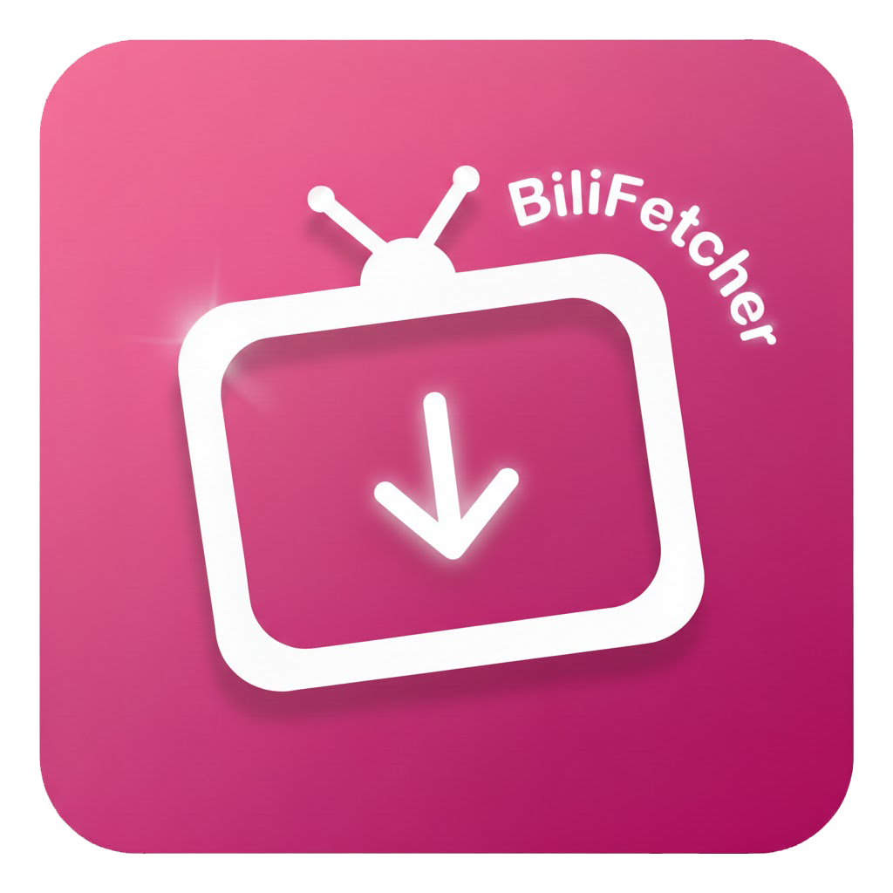
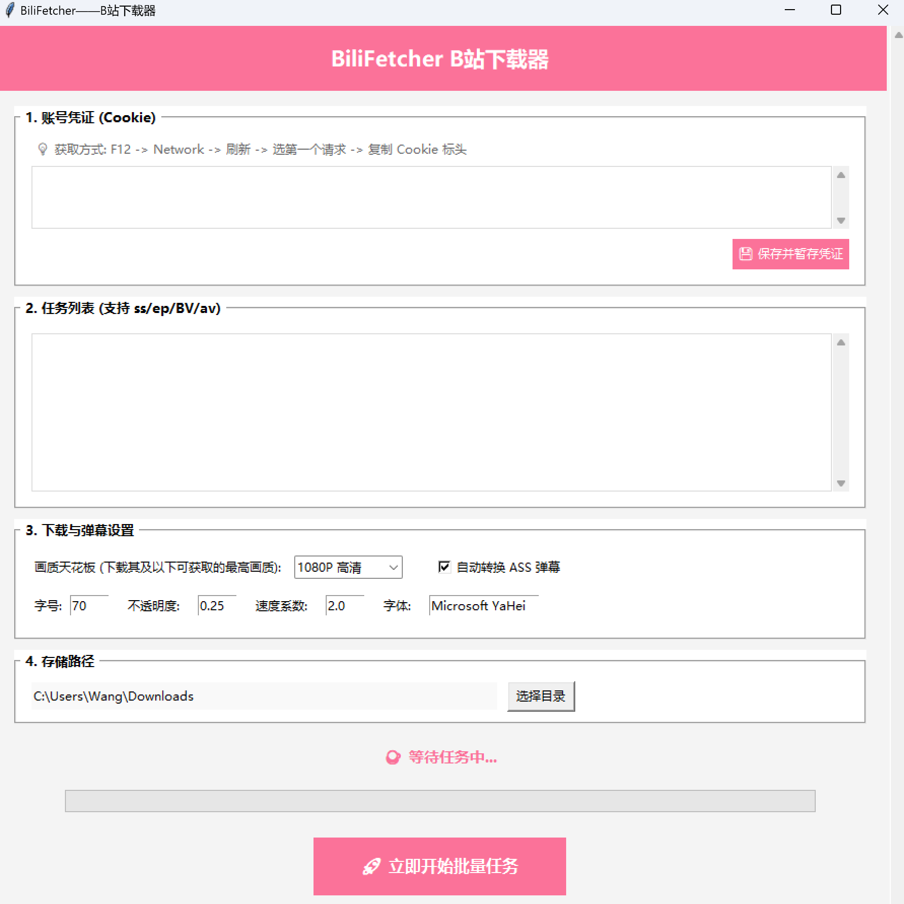

#  BiliFetcher

**BiliFetcher** 是一款高效的 Bilibili 视频/番剧批量下载工具。它支持自定义画质等级，并能同步生成 ASS 格式的弹幕文件，让用户在本地播放器观看 B 站视频的同时，也能完美挂载并体验实时弹幕。

## 📦 获取发布版本 (Release)

你可以直接下载并使用exe工具：

* 👉 **[BiliFetcher 最新版本下载页]()**

## ✨ 核心功能

* **全能解析**：支持 B 站番剧（ss/ep）及普通视频（BV/av）的批量解析下载。
* **智能画质匹配**：可指定目标画质上限，程序将自动下载该等级及以下的最优清晰度。
* **弹幕转换引擎**：自动生成 ASS 格式弹幕文件，支持自定义字号、不透明度、字体和流动速度。

## 🖥️ 界面使用指南

下载并运行 `BiliFetcher.exe` 后，你将看到以下四个主要操作区：

1. **账号凭证 (Cookie)**：在此处粘贴从浏览器获取的 Cookie。这是下载 **1080P+ 高清画质**及**大会员番剧**的关键凭证。
2. **任务列表**：将你想下载的视频或番剧的链接逐行粘贴进去。支持混合粘贴，程序会自动识别类型并批量下载。
3. **参数设置**：
* **画质天花板**：设置你期望的最高画质。如果视频本身达不到该画质，程序会智能选择能下载到的最高清晰度。
* **弹幕样式**：自由调节弹幕的大小（字号）、透明度（不透明度）和飞过屏幕的速度。

4. **存储路径**：点击“选择目录”指定视频下载后的存放位置。

---

## 🔑 如何获取并保存 Cookie

1. 在浏览器中登录 [Bilibili](https://www.bilibili.com) 并打开任意视频或番剧页面。
2. 按 `F12` 打开开发者工具，切换到 **网络 (Network)** 标签页。
3. **刷新页面**，在列表中点击第一个请求（通常以 `ep` 或视频BV号开头）。
4. 在右侧弹出面板的 **标头 (Headers)** -> **请求标头 (Request Headers)** 中找到 `Cookie`。
5. 复制其对应的全部长字符串，粘贴到软件的“账号凭证”框内，点击“保存”。

---

## ⚙️ 弹幕参数建议

* **不透明度**：建议设置在 `0.25 - 0.4` 之间，既能看清弹幕又不会遮挡视频主体。
* **速度系数**：越大越慢，推荐值为 `2.0`。如果觉得弹幕飞得太快看不清，可以尝试调大至 `2.5`。
* **字体及字号**：字体默认使用“微软雅黑”，你也可以填入电脑中已安装的其他字体名称。

---

## 🔗 参考资料

本工具的开发参考了以下技术分享：

* [Python爬取b站视频番剧](https://blog.csdn.net/qq_61020820/article/details/147919901?spm=1001.2014.3001.5506)
* [如何以正确的姿势下载全站的视频弹幕（包括电影和番剧）](https://www.bilibili.com/video/BV1Ca411e7au/?spm_id_from=333.1387.favlist.content.click&vd_source=f1a5ac0c372feff11ef7864e76373099)

---

## 📄 免责声明

本工具仅供个人学习和交流使用，请勿用于任何商业用途。下载内容版权归 Bilibili 及版权方所有，请尊重原作者的劳动成果。